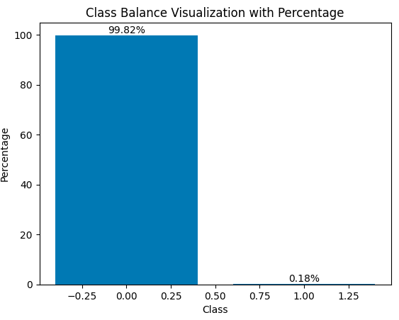
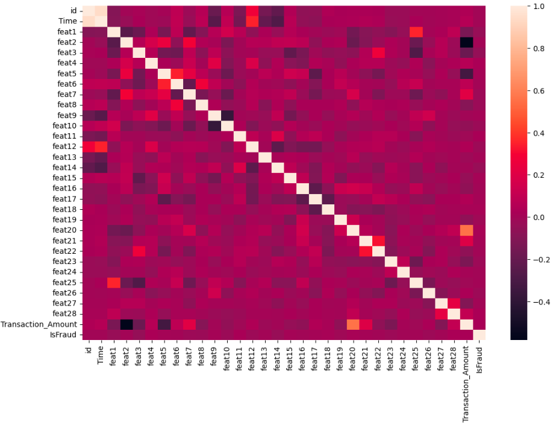

# Credit Card Fraud Detection using Machine Learning

## Overview

This project addresses the problem of credit card fraud detection using supervised machine learning techniques.

The work was developed as a final project for the Machine Learning & Deep Learning course at An-Najah National University and focuses on building, evaluating, and comparing multiple machine learning models for highly imbalanced fraud detection data.

The project investigates the impact of data preprocessing, class balancing, feature selection, hyperparameter tuning, ensemble learning, and model optimization on fraud detection performance.
## Project Workflow






---

## Problem Statement

Credit card fraud detection is a binary classification problem where the objective is to identify fraudulent transactions while minimizing false alarms.

One of the main challenges is the severe class imbalance in the dataset, where fraudulent transactions represent only a very small percentage of the total observations.

---

## Dataset

The project uses the Credit Card Fraud Detection dataset from a Kaggle competition.

Dataset characteristics:

- 150,000 training samples
- 69,129 testing samples
- 31 numerical features
- Binary target variable (Fraud / Non-Fraud)

Class distribution:

- Non-Fraud: 99.82%
- Fraud: 0.18%

This extreme imbalance required special preprocessing and resampling techniques before model training. :contentReference[oaicite:1]{index=1}

---

## Data Exploration and Analysis

Several exploratory data analysis steps were performed:

- Class imbalance visualization
- Data profiling
- Missing value detection
- Duplicate value analysis
- Descriptive statistics
- Feature distribution visualization
- Correlation heatmap analysis

---

## Data Preprocessing

The following preprocessing techniques were applied:

### Feature Scaling

- StandardScaler

### Handling Class Imbalance

- SMOTE (Synthetic Minority Oversampling Technique)

### Data Splitting

- 80% Training
- 20% Validation

### Feature Selection

- SelectKBest
- Mutual Information

### Dimensionality Reduction

- Principal Component Analysis (PCA)

---

## Machine Learning Models

The project evaluates multiple classification algorithms:

### Baseline Models

- Logistic Regression
- K-Nearest Neighbors (KNN)
- Gaussian Naive Bayes
- Random Forest

### Ensemble Models

- Balanced Random Forest
- LightGBM
- XGBoost

### Advanced Ensemble Techniques

- Soft Voting Classifier
- Stacking Classifier

---

## Hyperparameter Optimization

Different optimization strategies were investigated:

- Grid Search
- Randomized Search
- Cross Validation
- Regularization
- Threshold Optimization

Model-specific tuning was performed for:

- Gaussian Naive Bayes
- Balanced Random Forest
- XGBoost

---

## Evaluation Metrics

Models were evaluated using:

- Accuracy
- Precision
- Recall
- F1 Score
- ROC-AUC
- Confusion Matrix
- ROC Curves

In addition, Kaggle leaderboard scores were used as an external evaluation benchmark.

---

## Results Summary

Several models achieved strong performance after handling class imbalance and applying optimization techniques.

### Best Kaggle Scores

| Model | Kaggle Score |
|---------|-------------|
| Gaussian Naive Bayes | 0.80583 |
| XGBoost | 0.79683 |
| Balanced Random Forest | 0.67295 |
| LightGBM | 0.65742 |

The highest Kaggle score was achieved using Gaussian Naive Bayes, while XGBoost demonstrated the strongest overall validation performance across multiple evaluation metrics. :contentReference[oaicite:2]{index=2} :contentReference[oaicite:3]{index=3}

---

## Key Findings

- Class imbalance significantly affects model performance.
- SMOTE substantially improved fraud detection results.
- Ensemble methods improved validation performance in several cases.
- Hyperparameter tuning can improve validation metrics but may introduce overfitting.
- XGBoost achieved the strongest overall classification performance.
- Gaussian Naive Bayes achieved the highest Kaggle leaderboard score.

---

## Technologies Used

- Python
- NumPy
- Pandas
- Matplotlib
- Seaborn
- Scikit-Learn
- Imbalanced-Learn (SMOTE)
- LightGBM
- XGBoost

---

## Repository Structure

```text
01_credit_card_fraud_detection.ipynb
README.md
```

---

## Future Improvements

Potential future work includes:

- Deep Learning approaches
- AutoML experimentation
- Advanced anomaly detection techniques
- Cost-sensitive learning
- Explainable AI (XAI)
- Real-time fraud detection systems

---

## Author

**Mariam Shehada**

M.Sc. Student in Artificial Intelligence

Areas of Interest:

- Machine Learning
- Data Science
- Natural Language Processing
- Computer Vision
- Applied Artificial Intelligence
